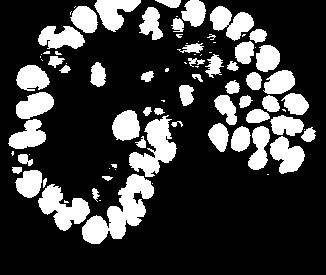

# Automatic tracking
[← Back to main page](INDEX.md)

The intended workflow is as follows:

1. Obtain nucleus positions (for now this is done using an external program)
2. Obtain nucleus shapes from positions
3. Link the cells of different time points together
4. Manually correct all warnings

The steps are described below.

Before you start, create a directory that will hold all you analysis data. You can create this directory inside the directory that holds your images.

Step 1: Obtaining nucleus positions
-----------------------------------

Open the AI_track GUI, load your images and select `Process` -> `Detect cells in images...`. Select the (already trained) neural network you want to use. You'll end up with a folder containing configuration files. Run the `ai_track_predict_positions.py` script in that directory to put the neural network into action. You'll end up with a file that contains the positions of the cells. Load it into the program to see how the neural network performed.

Step 2: Obtaining nucleus shapes
--------------------------------

Obtaining nucleus shapes is done using the `ai_track_detect_gaussian_shapes.py` script. Run it from the data analysis directory. It will ask you to set all parameters. Make sure the resolution, the path to the image folder and the path to the positions file are correct, and then run the script again.

Note: this script takes a few minutes to run per time point, so please be patient.

The script works by fitting 3D Gaussian functions to a blurred version of the original image, starting from the positions from step 1 and a default covariance matrix. To restrict the fitting algorithm, separate clusters of cells are fitted separately. In this way, the fitting algorithm will ignore debris elsewhere in the image. Clusters are found using a quick segmentation: every pixel that has an intensity lower than the local average is background, the rest is foreground (see figure 1). To improve the segmentation, some erosion can be applied, which makes the white areas in the figure 1 smaller. If your cells are already well separated, you can set it to 0, and if your cells form one big structure then a value of 3 may be necessary.

  
*Figure 1: Thresholding, used to separate foreground and background. Gaussian fits are carried out within clumps.*

Step 3: Obtaining links
-----------------------

Automatic linking is relatively fast: running the script should only take a few minutes.

Run the script `ai_track_create_links.py`. It will ask you to make sure that the paths to the images and to the nucleus positions and shapes are correct.

Step 4: Manually correct warnings
---------------------------------

This step is not automated. 😉 Open the AI_track GUI and load the images and data (`File` menu). Then go to `Edit -> Manually change data...`. Now you can use `View -> Lineage errors and warnings` to view which lineages have warnings in them. Lineages that are marked green are OK, lineages that are marked in gray need to be manually revisted.

To do this, hover you mouse over a nucleus and press E. You will be shown all errors in the lineage tree. Use the left and right arrow keys to move to the next error. Press E again to exit that view, and edit the data.

Data editing is done mainly using the Insert and Delete keys, which are used to insert and delete links. Detected positions can also be inserted and deleted if necessary.
