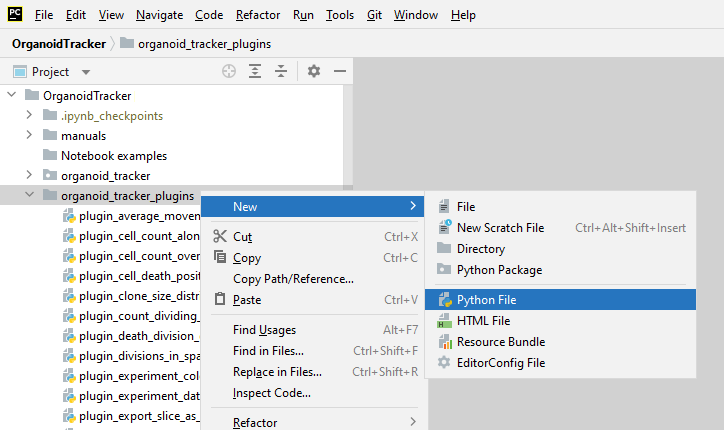
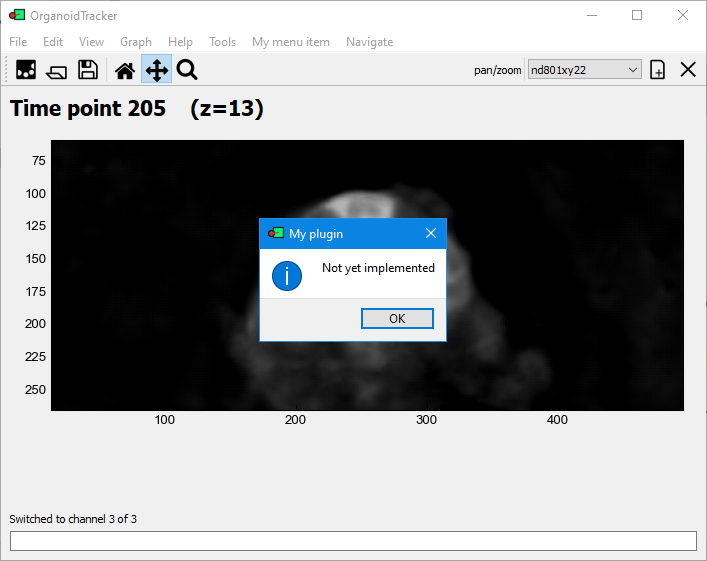

# Plugin tutorial
[← Back to main page](INDEX.md)

## Introduction
Plugins (like the rest of OrganoidTracker) are programmed in Python, a "friendly" programming language used from beginners to experts. Every Python file that you place in the `organoid_tracker_plugins` that starts with `plugin_` is automatically loaded when the program starts. Plugins can be reloaded while the program is running, making very quick development possible.

In this tutorial, we're going to create a plugin that how many detected cells there are in each time point. No prior programming knowledge is necessary to read the code, but for writing your own code some knowledge of Python is necessary. If you haven't used Python before, it's best to follow a course or have a supervisor explaining things to you. Alternatively, there is the website [automatetheboringstuff.com](https://automatetheboringstuff.com/) with a good Python tutorial.

## First steps
Let's get started. We will assume that you have opened the OrganoidTracker folder in PyCharm. Create a new Python file in the organoid_tracker_plugins folder:



Give the file a name like `plugin_some_example.py`. It's important that the file name starts with `plugin_`, otherwise OrganoidTracker will not know that it is a plugin.

Next, fill the file you just created with the following contents: *(copy-paste it, and note that every missing space or colon (':') can make your plugin crash)*

```python
from organoid_tracker.gui import dialog

def get_menu_items(window):
    return {
        "My menu item//Count cells in time points...": lambda: dialog.popup_message("My plugin", "Not yet implemented")
    }
```

We'll walk through the code shortly. First, open the OrganoidTracker program. Notice that in the menu bar now contains a "My menu item" item. If you open that menu and click on the only option, a dialog window pops up.



*The dialog window that should pop up.*

On the first line of the script, we import the `dialog` module, so that we can use that module later on to show a dialog message. On the third line (starting with `def`), we define a function called `get_menu_items` that takes one parameter, `window`. That parameter refers to the currently open window, and you can use it to access the currently loaded project(s). We will show how do that that later, but for now we're actually not using the window yet, so you won't see the word `window` elsewhere in the script. 

The function returns a so-called dictionary. If you haven't seen these structures before in Python, you should look them up, but for now we can show how you would use them to create a small "real" dictionary:

```python
my_dictionary = {
    "apple": "Type of fruit",
    "biology": "Study of living systems",
    "boat": "Vehicle for water transporation",
    "cell": "Some kind of enclosed space."
}
```

For our menu, it looks a bit different. The "lookup words" are now the names of the menu option, and the "descriptions" are now the actions that should be taken when that menu option is clicked. 

Here, the value is `lambda: dialog.popup_message("My plugin", "Not yet implemented")`, which stores a piece of code (using `lambda: `) to show a popup message later, with the window title set to `"My plugin"` and the contents set to `"Not yet implemented"`.

That's basically the entire plugin for now. Let's create a second function to do the actual calculations.

## Counting the cells
Replace the text in the plugin file you have previously created with the following:

```python
from organoid_tracker.gui import dialog

def get_menu_items(window):
    return {
        "My menu item//Count cells in time points...": lambda: _count_cells(window)
    }

def _count_cells(window):
    experiment = window.get_experiment()
    cell_counts = list()
    for time_point in experiment.time_points():
        cells_of_this_time_point = experiment.positions.of_time_point(time_point)
        cell_count_for_this_time_point = len(cells_of_this_time_point)
        
        cell_counts.append(cell_count_for_this_time_point)
    dialog.popup_message("My plugin", "The cells counts are " + str(cell_counts))
```

Save the file and reload all plugins (see the `File` menu of OrganoidTracker), or restart the program. If you have some tracking data loaded, the code will now display the number of cells at each time point, for example `[5, 5, 5, 6, 7, 7, 7]`. The part under `for time_point in experiment.time_points():` is run for reach time point, and every time that part runs it appends one value (the amount of cells in that time point) to the list `cell_counts`.

## Displaying a graph
It would be better to display this list as a graph. Fortunately, this is easily done using the widely used Python library Matplotlib. OrganoidTracker has a function to show a Matplotlib figure as a popup window. At the bottom of your plugin file, add the following function:

```python
def _display_my_figure(figure, cell_counts):
    axis = figure.gca()  # gca is short for "get current axis"
    
    axis.plot(cell_counts)  # Plots the points
    axis.set_xlabel("Time point")
    axis.set_ylabel("Cell count")
    
    figure.suptitle("Cell count over time")  # Supplies a title
```

Finally, replace the line `dialog.popup_message("My plugin", "The cells counts are " + str(cell_counts))` with
```python
dialog.popup_figure(window.get_gui_experiment(), lambda figure: _display_my_figure(figure, cell_counts))
```
to actually display that figure. The function `popup_figure` first sets up a window and then uses the code `lambda figure: _display_my_figure(figure, cell_counts))` to draw something to the figure that was just created.

After saving the file and reloading the plugins, you should now end up with a graph.

Congratulations, you now know the basics of plugin writing!OrganoidTracker contains a large number of functions that help you writing a plugin. See the [API](API.md) page for a short introduction. The main code of OrganoidTracker is also contains a lot of comments, which should help you understanding what the code is doing. A "smart" code editor that automatically displays documentation (such as Pycharm or Visual Studio Code) also helps a lot. Try and see if you can understand how the plugin `plugin_count_dividng_cells.py` works.

## Advanced techniques

### Additional locations for storing plugins
By default, OrganoidTracker loads all files starting with `plugin_` in the `organoid_tracker_plugins` folder. If you start do develop your own plugins, you may want to keep them in a separate folder. Here, we show how to instruct OrganoidTracker to load plugins from this seperate folder.

To add an additional plugin folder, create a file named `organoid_tracker.ini` in the folder from which you normally start OrganoidTracker. If you start OrganoidTracker from PyCharm, then you need to create this file in the root folder of the project (so in the same folder where the `organoid_tracker.py` file is located). Make sure that the file has the following contents:

```ini
[scripts]
extra_plugin_directory = C:\path\to\your\plugin\folder
```

Change the path so that it points to your plugin folder. Once you (re)start OrganoidTracker, it will load plugins from the specified folder.

### Multi-file plugins
For larger plugins, placing all code in a single file becomes unwieldy. Instead, you can also put your code in multiple files placed in a single directory. The directory must have a name that starts with `plugin_`, for example `plugin_directory_example`. In that folder, you must place an `__init__.py` file. This file should contain the hooks described above, such as the `get_menu_items` function. So you get this directory structure:

```
organoid_tracker_plugins/
    plugin_some_example.py
    plugin_other_example.py
    plugin_directory_example/
        __init__.py
        some_other_file_of_this_plugin.py
```

To access other Python files of your plugin, you need to use relative imports. For example, if you want to access a function named `do_some_work()` located in `some_other_file_of_this_plugin.py` from your `__init__.py` file, you could do that as follows:

```python
from . import some_other_file_of_this_plugin
some_other_file_of_this_plugin.do_some_work()
```

### Adding cell types
Create a plugin with these contents to implement support for stem and goblet cells:

```python
from organoid_tracker.core.marker import Marker
from organoid_tracker.core.position import Position

def get_markers():
    return [Marker([Position], "STEM", "stem cell", (182, 1, 1)),
            Marker([Position], "GOBLET", "goblet cell", (126, 255, 64))]
```

The `get_markers` method must return a list of `Marker`s. Each marker provides what it is targeting (`Position`), the name under which it is saved to the data files, a display name and a display color. The color is used for the border of the position markers and for the lineage trees.

### Adding command-line scripts

Adding an additional organoid_tracker script (like `organoid_tracker_compare_positions.py`) is not possible from a plugin. Instead, you can use a subcommand of `organoid_tracker.py`. Say you want to add a command named "my_command", then you could call it like:

`python organoid_tracker.py my_command`

To implement this, add the following code to your plugin:

```python
from typing import List


# This method is called by the plugin system
def get_commands():
    return {
        "my_command": _my_command_handler
    }


def _my_command_handler(args: List[str]) -> int:
    print("Hello world!", args)
    return 0
```

This will only call your command, and not show the graphical program. The last line of the command handler, `return 0`, means that the command executed succesfully. If it returns any other number, then this is seen as an error code. The error code is passed on to the operating system (Windows, Linux, etc.).
