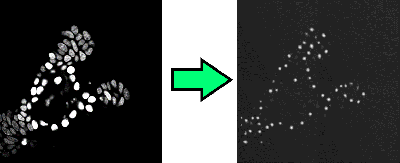

# Training the neural network
[← Back to main page](INDEX.md)

If you want to train your own neural network, read on. Training your own neural network is a good idea if you're not satisfied with how the cell detection in your images is done. However, training requires a good graphics card. I'm using a NVIDIA GeForce RTX 2080 Ti card, which has enough video RAM for a batch size of 48 with images of 512x512x32 px.

## Some theoretical background
The neural network works by finding correlations between the input images (the microscope images) and the output images (images with white dots where the cells are). This works because all the necessary information is in the input images, we "just" need to find some function that transforms the input image into the output image. In our case, we start with microscopy images and end up with images that clearly show where the cells are. See Figure 1.

  
Figure 1: The network goes from an input image to an image that shows where the nucleus centers are.

Machine learning automates this process. Convolutional neural networks, which are (very loosely) designed after how we think our brain works, have proven to be very successful on images. Basically, you give the algorithm a lot of examples of "this is a cell" and "this is not a cell", and then it will find out how it can recognize cells on it's own. For this, it fits the parameters of the neural network such that the network gets better and better in reproducing the images you gave it. You should definitely look up some information on how this algorithm works; there a lot of great videos. It will help you to better understand what can go wrong.

## Acquiring training data
First, you're going to need a lot of training data. The more and the more diverse the training data, the better. The training data should be a good sample of the data you eventually want to obtain. I'm using around 10000 data points (detected cells) myself. In the AI_track GUI in the `View` menu there is an options to view how many detected positions you have in your experiment.

Make sure that the data is correct! Even a low percentage of errors (1%) can already significantly weaken the training. You don't need to annotate the entire image, AI_track will crop your image to the area where there are annotations. This cropping uses a simple cuboid (3D rectangle) shape. However, within the area you're annotating you need to annotate each and every cell, otherwise you're teaching the network that those things are not cells. See Figure 2.

  
Figure 2: AI_track automatically sees that you have only annotated part of the image, so you don't need to annotate the entire image. However, you do need to annotate each and every cell within that region.

## The training process
Open the data of all the experiments you're going to use in the AI_track GUI, and use `Process` -> `Train the neural network...`. Run the resulting script. It will first convert your images and training data to a format Tensorflow (the software library we're using for the neural networks) can understand. Then, it will start training. The training process saves checkpoints. If you abort the training process, then it will resume from the most recent checkpoint when you start the program again.

By default, the training lasts for 1000000 steps, but you can modify this in the `ai_track.ini` file next to the script. Note that more steps is not always better. The more steps, the better the model will learn to recognize patterns in your data. However, if you train it for too long, then it will only recognize your training images, and not be able to do anything with any image that is even a little bit different. This is called overfitting. However, if you train the model for too few steps, then it will mark anything as a cell that looks even a bit like it.

Neural networks work differently from our own brains. If you change some microscopy settings, and now the noise in the images is different, then suddenly the neural network might not recognize your cells anymore. Also, if you give the network cells at a different resolution, it might no longer work.

To combat both effects, AI_track generates artificial data based on your input images. It makes cells brighter or darker and rotates them. This makes the algorithm less specific to your images. The program also randomizes the order in which it sees your training data, so that it is not training on a single experiment for a long time.

All in all, training a neural network is a difficult process. However, it has proven to be a very successful method, and for any complex image it will be worth it.
